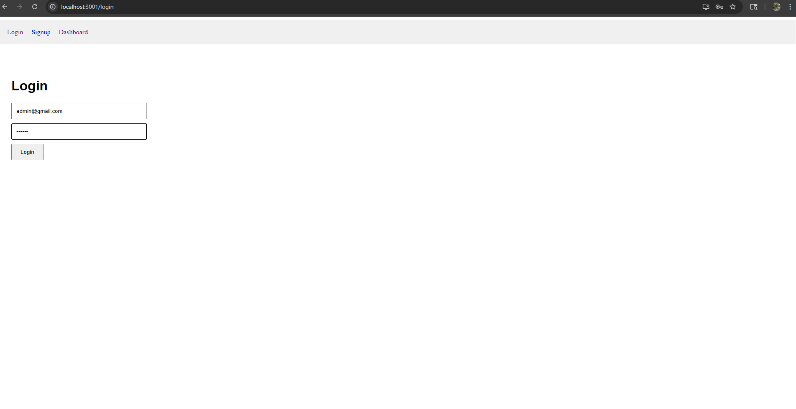
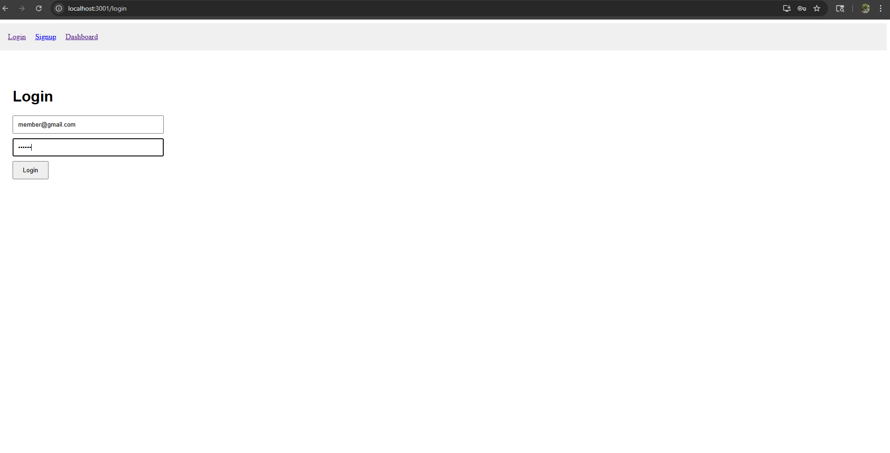
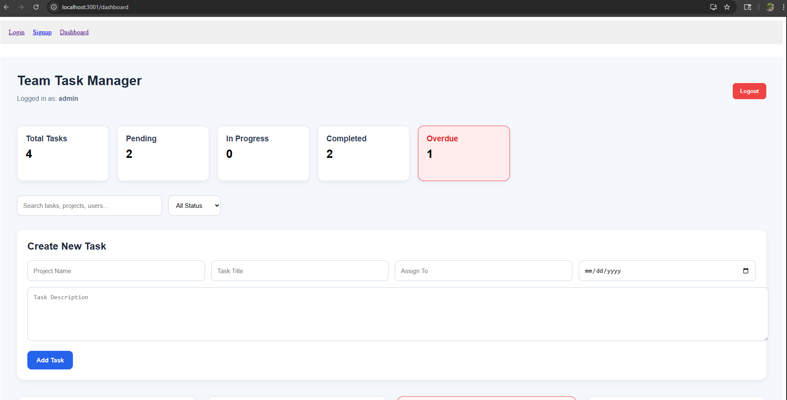
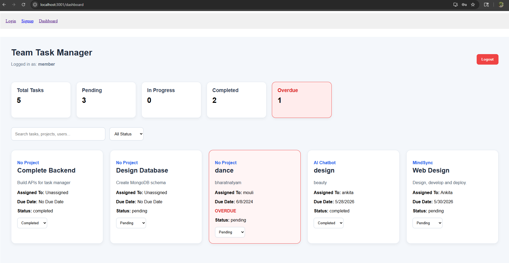
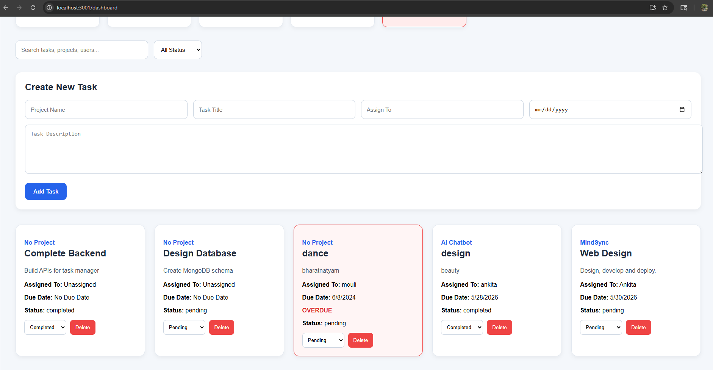

# Team Task Manager

A full-stack Team Task Management web application built using the MERN stack.

# Live Application

## Frontend:  https://team-task-manager-frontend-ehvr.onrender.com

## Backend:   https://team-task-manager-backend-56cg.onrender.com

## Features

- User Authentication (Login / Signup)
- Protected Routes using JWT
- Create, Edit, Delete Tasks
- Project-based Task Organization
- Task Status Filtering
- Search Functionality
- Overdue Task Highlighting
- Responsive Dashboard UI
- MongoDB Database Integration
- Role-based Access Control(Admin/Member)


## Screenshots

### Login Page (admin and member separately)





### Dashboard (admin and member separately)





### Tasks (admin creating and assigning task)




## Tech Stack

### Frontend
- React.js
- React Router
- CSS
- Axios

### Backend
- Node.js
- Express.js
- MongoDB
- Mongoose
- JWT Authentication

---

## Folder Structure

team-task-manager/
│
├── backend/
│ ├── models/
│ ├── routes/
│ ├── controllers/
│ ├── middleware/
│ └── server.js
│
├── frontend/
│ ├── src/
│ ├── public/
│ └── package.json
│
└── README.md

---

## Installation

### Clone Repository

```bash
git clone https://github.com/ankitaksah/team-task-manager.git
```

### Backend Setup

```bash
cd backend
npm install
npm start
```

### Frontend Setup

```bash
cd frontend
npm install
npm start
```


## Environment Variables

Create a .env file inside backend:

MONGO_URI=your_mongodb_connection
JWT_SECRET=your_secret_key

## Author

Ankita Kumari Sah
